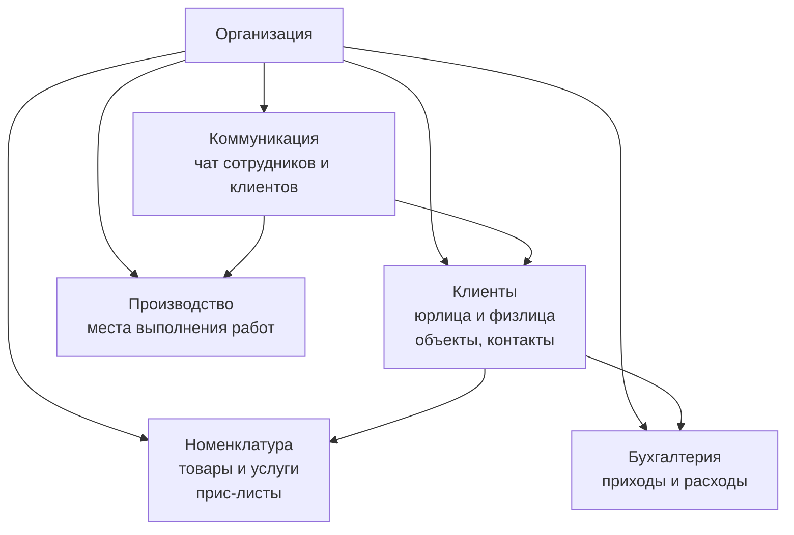
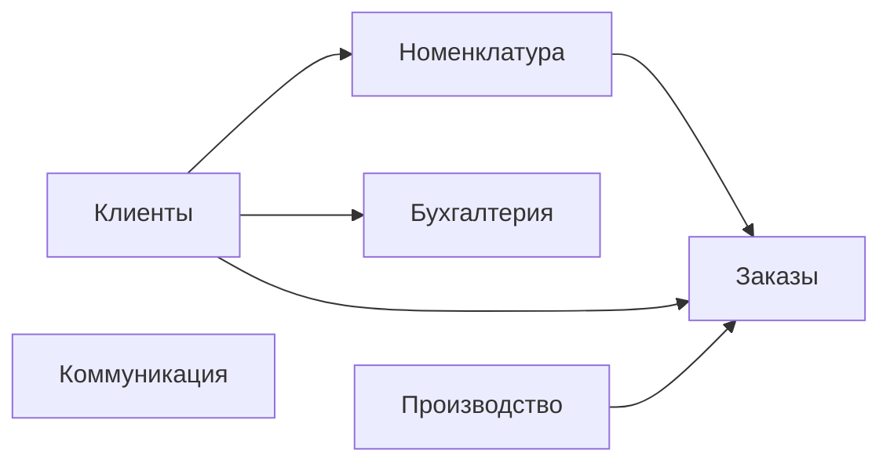
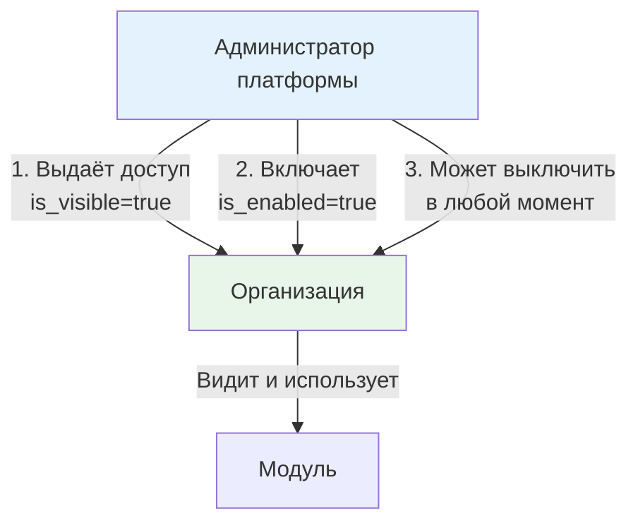

# Архитектура

Техническая архитектура PROFLAUNDRY. Язык этого раздела — точные компоненты, их границы, связи и зависимости.

Бизнес-логика и условия — в разделе [Бизнес-процесс](ref:business).

---

## Уровни системы

```
┌─────────────────────────────────────────────────┐
│                  ПЛАТФОРМА                      │
│   Мета-таблицы, биллинг организаций,            │
│   администрирование тенантов                    │
├─────────────────────────────────────────────────┤
│               ОРГАНИЗАЦИЯ (тенант)              │
│                                                 │
│  ┌──────────┐  ┌──────────────────────────────┐ │
│  │          │  │          МОДУЛИ              │ │
│  │   ЯДРО   │  │  (включаются per-org)        │ │
│  │          │  │  Логистика, Склад, Зарплата, │ │
│  │          │  │  Клиентский портал, ...      │ │
│  └──────────┘  └──────────────────────────────┘ │
└─────────────────────────────────────────────────┘
```

---

## Ядро

Пять универсальных компонентов, применимых к любому бизнесу. Работают без каких-либо модулей.



| Компонент | Назначение | Специфика в ядре |
|-----------|-----------|-----------------|
| **Клиенты** | Юрлица и физлица, объекты, контакты | Базовые атрибуты, прайс-лист, иерархия объектов |
| **Номенклатура** | Справочник товаров/услуг, группы, прайс-листы | Иерархия org → client → object |
| **Производство** | Абстрактная локация выполнения работ | Только базовые атрибуты; смысл задаёт отрасль |
| **Бухгалтерия** | Финансовые потоки (приходы/расходы) | Ручной ввод; автоматизация — через модули |
| **Коммуникация** | Чат с контекстом на любую сущность | Контекст универсальный (GenericForeignKey) |

---

## Платформенный уровень

Работает поверх всех организаций. Не видим самим организациям.

| Компонент | Назначение |
|-----------|-----------|
| **Тенанты** | Управление организациями, их модулями, тарификацией |
| **Мета-реестр клиентов** | Сквозная идентификация (юрлица по ИНН); связывает клиентов из разных организаций |
| **Биллинг платформы** | Учёт подписок организаций |

---

## Принцип модулей

**Всё в системе — модуль.** Не существует кода «вне модулей». Разница только в режиме включения:

| Тип | Режим | Изменить можно? |
|-----|-------|----------------|
| **Базовый модуль** | Включён по умолчанию | Да — перевести в дополнительный |
| **Дополнительный модуль** | Выключен по умолчанию | Да — перевести в базовый |

Перевод модуля из дополнительного в базовый (или обратно) — изменение конфигурации платформы, не архитектуры.

Модули могут **расширять** друг друга — зависимости явные:

```
Заказы (базовый)
    ├── Приёмка (доп.) — расширяет Заказы под отраслевой процесс
    ├── Логистика (доп.) — добавляет маршруты и транспорт к Заказам
    └── Клиентский портал (доп.) — даёт клиентам доступ к Заказам
```

Управление модулями двухуровневое:
- **Администратор платформы** — управляет любым модулем любой организации
- **Организация** — управляет модулями, которые платформа ей разрешила трогать

---

## Базовые модули (ядро по умолчанию)



| Модуль | Что входит |
|--------|-----------|
| **Клиенты** | Юрлица/физлица, объекты, контакты, прайс-листы |
| **Номенклатура** | Товары и услуги, группы, иерархия прайсов |
| **Производство** | Абстрактные локации выполнения работ |
| **Бухгалтерия** | Приходы и расходы, ручной ввод |
| **Коммуникация** | Чат сотрудников и клиентов, контекст на любую сущность |
| **Заказы** | Универсальный жизненный цикл заказа |

---

## Дополнительные модули (примеры)

| Модуль | Расширяет | Что добавляет |
|--------|-----------|--------------|
| **Приёмка** | Заказы | Отраслевой процесс обработки (прачечная, мастерская...) |
| **Логистика** | Заказы | Маршрутные листы, транспорт, экспедиторы |
| **Клиентский портал** | Заказы, Коммуникация | Внешний доступ клиентов |
| **Склад** | Бухгалтерия | Учёт запасов, закупки |
| **Зарплата / HR** | Бухгалтерия | Начисление зарплат, кадры |
| **Аналитика** | — | Отчёты и дашборды |
| **Уведомления** | Коммуникация | Push/email/SMS по событиям |

*Конкретный состав и границы уточняются отдельно.*

---

## 1С-концепции в нашей реализации

Система строится на концепциях 1С — они проверены временем и хорошо описывают бизнес-процессы. Мы адаптируем их под Django.

| 1С концепция | Что делает | Наш аналог |
|---|---|---|
| **Справочник** | Эталонные данные: клиенты, номенклатура, сотрудники. Редко меняются, не проводятся. | Django Model (без `is_posted`) |
| **Документ** | Бизнес-событие: заказ, расчётный лист, маршрутный лист. Имеет статус проведения. | Django Model с `is_posted: bool` |
| **Проведение** | Атомарная операция: фиксация документа + запись движений в регистры. После — документ защищён. | `posting.py` service |
| **Регистр накопления** | Хранит текущие остатки/итоги. Обновляется при проведении документов. | Aggregate Model (пишется через posting) |
| **Регистр сведений** | Хранит историю по периодам. Не связан с проведением. | History/Schedule Model |
| **Журнал документов** | Сводный список нескольких типов документов для навигации. | List view / QuerySet по нескольким моделям |
| **Отчёт** | Запрос по регистрам. Только чтение, не меняет данные. | Query/aggregation слой |
| **Обработка** | Фоновая операция или пакетное действие. | Service class / Celery task |

### Ключевые правила

**Справочник не влияет на проведённые документы.** Изменение цены в прайс-листе не меняет уже проведённый расчётный лист — документ хранит копию значений на момент проведения.

**Документ после проведения защищён.** Изменить проведённый документ нельзя. Если нужна правка — сначала распроведение (явная операция), затем изменение, затем повторное проведение.

**Регистры — производный слой.** Остатки и итоги никогда не считаются напрямую из документов. Они всегда читаются из регистров, которые наполняются при проведении.

---

## Техническая реализация модулей

### Модуль = Django App

Каждый модуль — отдельное Django-приложение. Приложение объявляет себя через `AppConfig`:

```python
# modules/orders/apps.py
class OrdersConfig(AppConfig):
    name = "modules.orders"
    label = "orders"

    # Метаданные модуля
    module_meta = {
        "title": "Заказы",
        "description": "Универсальный жизненный цикл заказа",
        "is_base": True,           # базовый = включён по умолчанию
        "depends_on": ["clients", "nomenclature"],
    }
```

Все модули всегда установлены и задеплоены. «Включение» — feature flag в БД, не загрузка кода.

### Таблица модулей организации

```
OrganizationModule
├── organization  FK → Organization
├── module        str  (app label, например "orders")
├── is_visible    bool (администратор выдал доступ — орг видит модуль)
└── is_enabled    bool (модуль активен для организации)
```

Состояния:

| is_visible | is_enabled | Что видит организация |
|:---:|:---:|---|
| false | false | Модуль не существует для организации |
| true | false | Видит модуль, но он отключён |
| true | true | Модуль работает |

### Управление модулями



Организация **не управляет модулями самостоятельно**. Вся инициатива — на стороне администратора платформы.

### Как модуль расширяет другой модуль

Через явные зависимости и Django-сигналы / хуки. Модуль `reception` знает о модуле `orders` и регистрирует расширения при старте:

```python
# modules/reception/apps.py
module_meta = {
    "depends_on": ["orders"],   # reception требует orders
}

def ready(self):
    # регистрирует дополнительные точки входа в заказ
    from modules.orders import hooks
    hooks.register("order_detail", self.provide_reception_tab)
```

Модуль `orders` при этом ничего не знает о `reception`.

---

## Состав модуля

Каждый модуль — Django-приложение со стандартной структурой. Структура одинакова для всех модулей.

```
modules/
  <module>/
    apps.py              # AppConfig: title, is_base, depends_on
    models/
      __init__.py
      directories.py     # Справочники (эталонные данные)
      documents.py       # Документы (с проведением)
      registers.py       # Регистры (накопления, сведений)
    services/
      __init__.py
      posting.py         # Логика проведения документов
    hooks.py             # Точки расширения, которые модуль открывает другим
    signals.py           # Подключение к точкам расширения других модулей
    serializers.py
    views.py
    urls.py
    admin.py
    migrations/
```

### Что делает каждая часть

| Файл | Назначение |
|---|---|
| `apps.py` | Объявляет модуль: метаданные, зависимости, базовый/дополнительный |
| `models/directories.py` | Справочники модуля — эталонные данные без проведения |
| `models/documents.py` | Документы модуля — бизнес-события с `is_posted` |
| `models/registers.py` | Регистры модуля — остатки и история, наполняются через posting |
| `services/posting.py` | Атомарная операция проведения/распроведения документов |
| `hooks.py` | Точки расширения, которые этот модуль предоставляет другим |
| `signals.py` | Регистрация в хуках других модулей (выполняется в `ready()`) |

### Правило изоляции

Модуль **читает** чужие справочники через явный `FK` (если указал зависимость в `depends_on`).
Модуль **никогда** не пишет напрямую в модели другого модуля — только через хуки и сигналы.

### Пример: модуль Заказы

```python
# modules/orders/models/documents.py
class Order(models.Model):
    organization = models.ForeignKey("platform.Organization", ...)
    client       = models.ForeignKey("clients.Client", ...)   # зависимость от clients
    is_posted    = models.BooleanField(default=False)
    posted_at    = models.DateTimeField(null=True)

    class Meta:
        # после проведения — только чтение
        pass
```

```python
# modules/orders/services/posting.py
from django.db import transaction

def post_order(order):
    with transaction.atomic():
        # 1. Проверки перед проведением
        # 2. Генерация записей в регистры
        # 3. Установка is_posted = True
        order.is_posted = True
        order.posted_at = now()
        order.save()
```

---

## Следующие разделы архитектуры

*Разделы добавляются по мере проектирования.*
