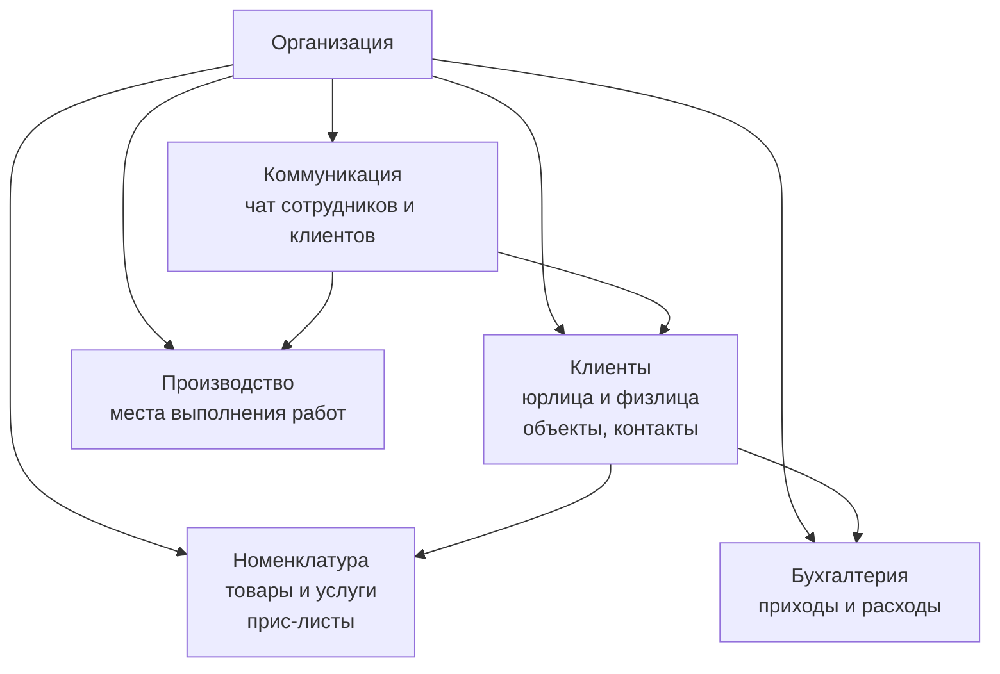
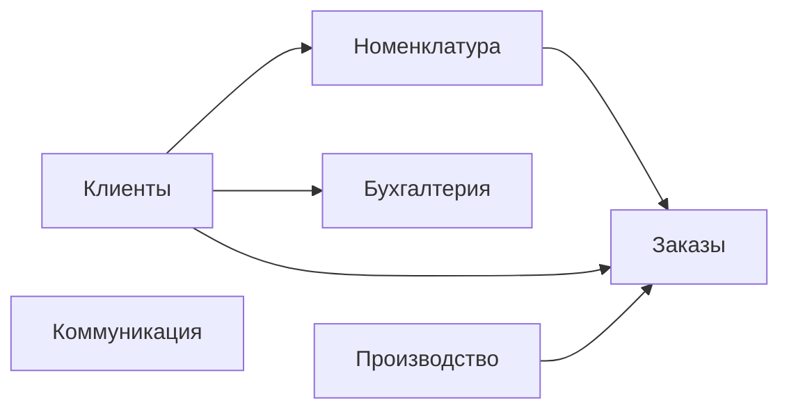

# Архитектура

Техническая архитектура PROFLAUNDRY. Язык этого раздела — точные компоненты, их границы, связи и зависимости.

Бизнес-логика и условия — в разделе [Бизнес-процесс](ref:business).

---

## Уровни системы

```
┌─────────────────────────────────────────────────┐
│                  ПЛАТФОРМА                      │
│   Мета-таблицы, биллинг организаций,            │
│   администрирование тенантов                    │
├─────────────────────────────────────────────────┤
│               ОРГАНИЗАЦИЯ (тенант)              │
│                                                 │
│  ┌──────────┐  ┌──────────────────────────────┐ │
│  │          │  │          МОДУЛИ              │ │
│  │   ЯДРО   │  │  (включаются per-org)        │ │
│  │          │  │  Логистика, Склад, Зарплата, │ │
│  │          │  │  Клиентский портал, ...      │ │
│  └──────────┘  └──────────────────────────────┘ │
└─────────────────────────────────────────────────┘
```

---

## Ядро

Пять универсальных компонентов, применимых к любому бизнесу. Работают без каких-либо модулей.



| Компонент | Назначение | Специфика в ядре |
|-----------|-----------|-----------------|
| **Клиенты** | Юрлица и физлица, объекты, контакты | Базовые атрибуты, прайс-лист, иерархия объектов |
| **Номенклатура** | Справочник товаров/услуг, группы, прайс-листы | Иерархия org → client → object |
| **Производство** | Абстрактная локация выполнения работ | Только базовые атрибуты; смысл задаёт отрасль |
| **Бухгалтерия** | Финансовые потоки (приходы/расходы) | Ручной ввод; автоматизация — через модули |
| **Коммуникация** | Чат с контекстом на любую сущность | Контекст универсальный (GenericForeignKey) |

---

## Платформенный уровень

Работает поверх всех организаций. Не видим самим организациям.

| Компонент | Назначение |
|-----------|-----------|
| **Тенанты** | Управление организациями, их модулями, тарификацией |
| **Мета-реестр клиентов** | Сквозная идентификация (юрлица по ИНН); связывает клиентов из разных организаций |
| **Биллинг платформы** | Учёт подписок организаций |

---

## Принцип модулей

**Всё в системе — модуль.** Не существует кода «вне модулей». Разница только в режиме включения:

| Тип | Режим | Изменить можно? |
|-----|-------|----------------|
| **Базовый модуль** | Включён по умолчанию | Да — перевести в дополнительный |
| **Дополнительный модуль** | Выключен по умолчанию | Да — перевести в базовый |

Перевод модуля из дополнительного в базовый (или обратно) — изменение конфигурации платформы, не архитектуры.

Модули могут **расширять** друг друга — зависимости явные:

```
Заказы (базовый)
    ├── Приёмка (доп.) — расширяет Заказы под отраслевой процесс
    ├── Логистика (доп.) — добавляет маршруты и транспорт к Заказам
    └── Клиентский портал (доп.) — даёт клиентам доступ к Заказам
```

Управление модулями двухуровневое:
- **Администратор платформы** — управляет любым модулем любой организации
- **Организация** — управляет модулями, которые платформа ей разрешила трогать

---

## Базовые модули (ядро по умолчанию)



| Модуль | Что входит |
|--------|-----------|
| **Клиенты** | Юрлица/физлица, объекты, контакты, прайс-листы |
| **Номенклатура** | Товары и услуги, группы, иерархия прайсов |
| **Производство** | Абстрактные локации выполнения работ |
| **Бухгалтерия** | Приходы и расходы, ручной ввод |
| **Коммуникация** | Чат сотрудников и клиентов, контекст на любую сущность |
| **Заказы** | Универсальный жизненный цикл заказа |

---

## Дополнительные модули (примеры)

| Модуль | Расширяет | Что добавляет |
|--------|-----------|--------------|
| **Приёмка** | Заказы | Отраслевой процесс обработки (прачечная, мастерская...) |
| **Логистика** | Заказы | Маршрутные листы, транспорт, экспедиторы |
| **Клиентский портал** | Заказы, Коммуникация | Внешний доступ клиентов |
| **Склад** | Бухгалтерия | Учёт запасов, закупки |
| **Зарплата / HR** | Бухгалтерия | Начисление зарплат, кадры |
| **Аналитика** | — | Отчёты и дашборды |
| **Уведомления** | Коммуникация | Push/email/SMS по событиям |

*Конкретный состав и границы уточняются отдельно.*

---

## Следующие разделы архитектуры

*Разделы добавляются по мере проектирования.*
