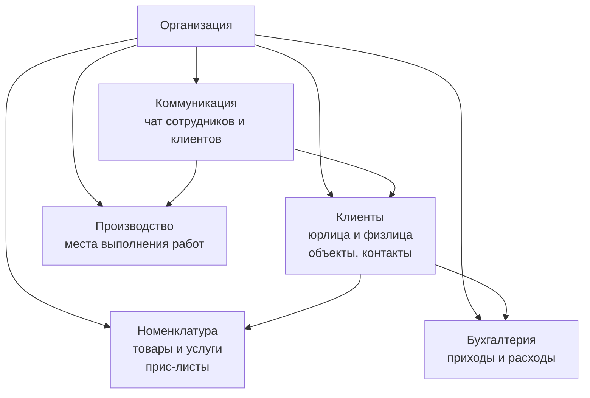
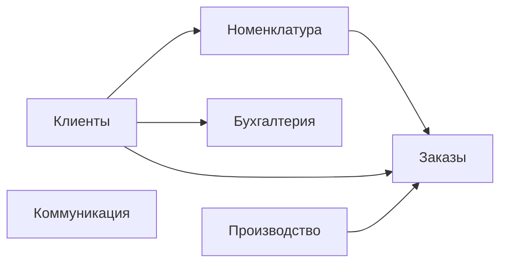
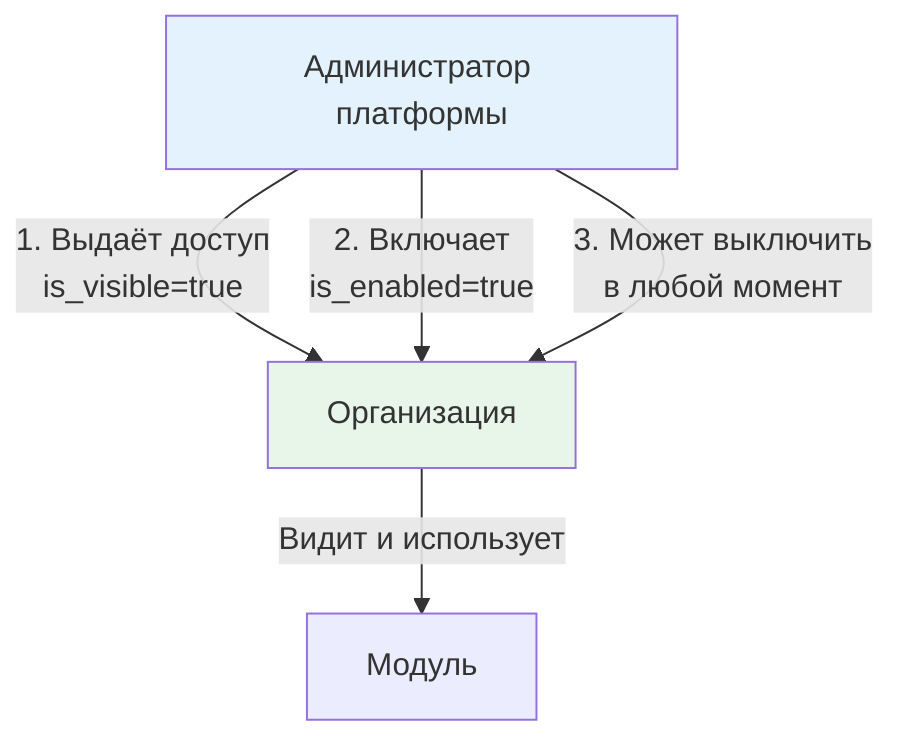

# Архитектура

Техническая архитектура PROFLAUNDRY. Язык этого раздела — точные компоненты, их границы, связи и зависимости.

Бизнес-логика и условия — в разделе [Бизнес-процесс](ref:business).

---

## Уровни системы

```
┌─────────────────────────────────────────────────┐
│                  ПЛАТФОРМА                      │
│   Мета-таблицы, биллинг организаций,            │
│   администрирование тенантов                    │
├─────────────────────────────────────────────────┤
│               ОРГАНИЗАЦИЯ (тенант)              │
│                                                 │
│  ┌──────────┐  ┌──────────────────────────────┐ │
│  │          │  │          МОДУЛИ              │ │
│  │   ЯДРО   │  │  (включаются per-org)        │ │
│  │          │  │  Логистика, Склад, Зарплата, │ │
│  │          │  │  Клиентский портал, ...      │ │
│  └──────────┘  └──────────────────────────────┘ │
└─────────────────────────────────────────────────┘
```

---

## Ядро

Пять универсальных компонентов, применимых к любому бизнесу. Работают без каких-либо модулей.



| Компонент | Назначение | Специфика в ядре |
|-----------|-----------|-----------------|
| **Клиенты** | Юрлица и физлица, объекты, контакты | Базовые атрибуты, прайс-лист, иерархия объектов |
| **Номенклатура** | Справочник товаров/услуг, группы, прайс-листы | Иерархия org → client → object |
| **Производство** | Абстрактная локация выполнения работ | Только базовые атрибуты; смысл задаёт отрасль |
| **Бухгалтерия** | Финансовые потоки (приходы/расходы) | Ручной ввод; автоматизация — через модули |
| **Коммуникация** | Чат с контекстом на любую сущность | Контекст универсальный (GenericForeignKey) |

---

## Платформенный уровень

Работает поверх всех организаций. Не видим самим организациям.

| Компонент | Назначение |
|-----------|-----------|
| **Тенанты** | Управление организациями, их модулями, тарификацией |
| **Мета-реестр клиентов** | Сквозная идентификация (юрлица по ИНН); связывает клиентов из разных организаций |
| **Биллинг платформы** | Учёт подписок организаций |

---

## Принцип модулей

**Всё в системе — модуль.** Не существует кода «вне модулей». Разница только в режиме включения:

| Тип | Режим | Изменить можно? |
|-----|-------|----------------|
| **Базовый модуль** | Включён по умолчанию | Да — перевести в дополнительный |
| **Дополнительный модуль** | Выключен по умолчанию | Да — перевести в базовый |

Перевод модуля из дополнительного в базовый (или обратно) — изменение конфигурации платформы, не архитектуры.

Модули могут **расширять** друг друга — зависимости явные:

```
Заказы (базовый)
    ├── Приёмка (доп.) — расширяет Заказы под отраслевой процесс
    ├── Логистика (доп.) — добавляет маршруты и транспорт к Заказам
    └── Клиентский портал (доп.) — даёт клиентам доступ к Заказам
```

Управление модулями двухуровневое:
- **Администратор платформы** — управляет любым модулем любой организации
- **Организация** — управляет модулями, которые платформа ей разрешила трогать

---

## Базовые модули (ядро по умолчанию)



| Модуль | Что входит |
|--------|-----------|
| **Клиенты** | Юрлица/физлица, объекты, контакты, прайс-листы |
| **Номенклатура** | Товары и услуги, группы, иерархия прайсов |
| **Производство** | Абстрактные локации выполнения работ |
| **Бухгалтерия** | Приходы и расходы, ручной ввод |
| **Коммуникация** | Чат сотрудников и клиентов, контекст на любую сущность |
| **Заказы** | Универсальный жизненный цикл заказа |

---

## Дополнительные модули (примеры)

| Модуль | Расширяет | Что добавляет |
|--------|-----------|--------------|
| **Приёмка** | Заказы | Отраслевой процесс обработки (прачечная, мастерская...) |
| **Логистика** | Заказы | Маршрутные листы, транспорт, экспедиторы |
| **Клиентский портал** | Заказы, Коммуникация | Внешний доступ клиентов |
| **Склад** | Бухгалтерия | Учёт запасов, закупки |
| **Зарплата / HR** | Бухгалтерия | Начисление зарплат, кадры |
| **Аналитика** | — | Отчёты и дашборды |
| **Уведомления** | Коммуникация | Push/email/SMS по событиям |

*Конкретный состав и границы уточняются отдельно.*

---

## 1С-концепции в нашей реализации

Система строится на концепциях 1С — они проверены временем и хорошо описывают бизнес-процессы. Мы адаптируем их под Django.

| 1С концепция | Что делает | Наш аналог |
|---|---|---|
| **Справочник** | Эталонные данные: клиенты, номенклатура, сотрудники. Редко меняются, не проводятся. | Django Model (без `is_posted`) |
| **Документ** | Бизнес-событие: заказ, расчётный лист, маршрутный лист. Имеет статус проведения. | Django Model с `is_posted: bool` |
| **Проведение** | Атомарная операция: фиксация документа + запись движений в регистры. После — документ защищён. | `posting.py` service |
| **Регистр накопления** | Хранит текущие остатки/итоги. Обновляется при проведении документов. | Aggregate Model (пишется через posting) |
| **Регистр сведений** | Хранит историю по периодам. Не связан с проведением. | History/Schedule Model |
| **Журнал документов** | Сводный список нескольких типов документов для навигации. | List view / QuerySet по нескольким моделям |
| **Отчёт** | Запрос по регистрам. Только чтение, не меняет данные. | Query/aggregation слой |
| **Обработка** | Фоновая операция или пакетное действие. | Service class / Celery task |

### Ключевые правила

**Справочник не влияет на проведённые документы.** Изменение цены в прайс-листе не меняет уже проведённый расчётный лист — документ хранит копию значений на момент проведения.

**Документ после проведения защищён.** Изменить проведённый документ нельзя. Если нужна правка — сначала распроведение (явная операция), затем изменение, затем повторное проведение.

**Регистры — производный слой.** Остатки и итоги никогда не считаются напрямую из документов. Они всегда читаются из регистров, которые наполняются при проведении.

**1С-концепции применяются только к тому что видит организация.** Модели внутри `modules/*/` — справочники, документы, регистры — должны следовать 1С-архитектуре, потому что именно с ними работают сотрудники организаций. Внутренние таблицы платформы (`platform_core`) организациям недоступны и не обязаны следовать этим концепциям — там файлы называются по предметной области (например `employee.py`, `roles.py`).

---

## Техническая реализация модулей

### Модуль = Django App

Каждый модуль — отдельное Django-приложение. Приложение объявляет себя через `AppConfig`:

```python
# modules/orders/apps.py
class OrdersConfig(AppConfig):
    name = "modules.orders"
    label = "orders"

    # Метаданные модуля
    module_meta = {
        "title": "Заказы",
        "description": "Универсальный жизненный цикл заказа",
        "is_base": True,           # базовый = включён по умолчанию
        "depends_on": ["clients", "nomenclature"],
    }
```

Все модули всегда установлены и задеплоены. «Включение» — feature flag в БД, не загрузка кода.

### Таблица модулей организации

```
OrganizationModule
├── organization  FK → Organization
├── module        str  (app label, например "orders")
├── is_visible    bool (администратор выдал доступ — орг видит модуль)
└── is_enabled    bool (модуль активен для организации)
```

Состояния:

| is_visible | is_enabled | Что видит организация |
|:---:|:---:|---|
| false | false | Модуль не существует для организации |
| true | false | Видит модуль, но он отключён |
| true | true | Модуль работает |

### Управление модулями



Организация **не управляет модулями самостоятельно**. Вся инициатива — на стороне администратора платформы.

### Как модуль расширяет другой модуль

Через явные зависимости и Django-сигналы / хуки. Модуль `reception` знает о модуле `orders` и регистрирует расширения при старте:

```python
# modules/reception/apps.py
module_meta = {
    "depends_on": ["orders"],   # reception требует orders
}

def ready(self):
    # регистрирует дополнительные точки входа в заказ
    from modules.orders import hooks
    hooks.register("order_detail", self.provide_reception_tab)
```

Модуль `orders` при этом ничего не знает о `reception`.

---

## Состав модуля

Каждый модуль — Django-приложение со стандартной структурой. Структура одинакова для всех модулей.

### Вариант А: плоские файлы (простые модули)

Когда в каждой категории мало моделей — достаточно одного файла на категорию:

```
modules/
  <module>/
    apps.py
    models/
      __init__.py
      directories.py     # Все справочники модуля
      documents.py       # Все документы модуля
      registers.py       # Все регистры модуля
    services/
      posting.py
    hooks.py
    signals.py
    admin.py
    migrations/
```

### Вариант Б: папки (модули с большим числом сущностей)

Когда сущностей много — каждая категория становится папкой, внутри файлы по предметной области:

```
modules/
  <module>/
    apps.py
    models/
      __init__.py
      directories/
        __init__.py
        client.py
        client_object.py
      documents/
        __init__.py
        order.py
      registers/
        __init__.py
        balance.py
    services/
      posting.py
    hooks.py
    signals.py
    admin.py
    migrations/
```

Оба варианта равнозначны — выбор зависит от размера модуля. Переход от А к Б не меняет поведение, только структуру файлов. Главное правило остаётся: `directories/`, `documents/`, `registers/` — 1С-категории, внутри — файлы по предметной области.

### Что делает каждая часть

| Путь | Назначение |
|---|---|
| `apps.py` | Объявляет модуль: метаданные, зависимости, базовый/дополнительный |
| `models/directories` | Справочники модуля — эталонные данные без проведения |
| `models/documents` | Документы модуля — бизнес-события с `is_posted` |
| `models/registers` | Регистры модуля — остатки и история, наполняются через posting |
| `services/posting.py` | Атомарная операция проведения/распроведения документов |
| `hooks.py` | Точки расширения, которые этот модуль предоставляет другим |
| `signals.py` | Регистрация в хуках других модулей (выполняется в `ready()`) |

### Правило изоляции

Модуль **читает** чужие справочники через явный `FK` (если указал зависимость в `depends_on`).
Модуль **никогда** не пишет напрямую в модели другого модуля — только через хуки и сигналы.

### Пример: модуль Заказы

```python
# modules/orders/models/documents.py
class Order(models.Model):
    organization = models.ForeignKey("platform.Organization", ...)
    client       = models.ForeignKey("clients.Client", ...)   # зависимость от clients
    is_posted    = models.BooleanField(default=False)
    posted_at    = models.DateTimeField(null=True)

    class Meta:
        # после проведения — только чтение
        pass
```

```python
# modules/orders/services/posting.py
from django.db import transaction

def post_order(order):
    with transaction.atomic():
        # 1. Проверки перед проведением
        # 2. Генерация записей в регистры
        # 3. Установка is_posted = True
        order.is_posted = True
        order.posted_at = now()
        order.save()
```

---

## Изоляция данных и межуровневые связи

В системе три уровня изоляции данных:

```
Платформа  (platform_core)   — данные без привязки к организации
    │
Организация (тенант)         — данные с FK на Organization
    │
Модуль      (modules/*)      — данные модуля, изолированные внутри организации
```

**Общий принцип:** таблица нижнего уровня **никогда не содержит FK** на таблицу верхнего уровня. Связь между уровнями оформляется через **отдельную link-таблицу** на том же уровне, что и вышестоящая таблица.

### Почему не FK напрямую

Прямой FK из организационной таблицы (например `Client`) в платформенную (`MetaClient`) нарушает изоляцию двумя способами:

1. **Модульность** — модуль начинает зависеть от платформенной сущности, которая к нему не относится. Если `MetaClient` изменится, сломается `Client`.
2. **Защита данных** — FK виден в схеме БД и в ORM организации. Организация потенциально может обойти изоляцию, пройдя по обратному FK.

### Паттерн link-таблицы

Вместо FK — отдельная таблица-связка. Она живёт на уровне владельца связи (платформа), а не на уровне подчинённой таблицы (модуль).

```
platform_core/
  MetaClient           — платформенный реестр (без org FK)
  MetaClientLink       — связка: MetaClient ↔ Client (без org FK)
                          поля: meta FK, org_id, client_id
modules/clients/
  Client               — организационная таблица (org FK)
                          НЕТ ссылки на MetaClient
```

Схема работы:

```
MetaClient ←── MetaClientLink ──→ Client (org A)
                              └──→ Client (org B)
```

`Client` не знает о своём существовании в мета-реестре. Платформа знает об обоих.

### Правило именования

| Уровень | Шаблон | Пример |
|---------|--------|--------|
| Платформенный реестр | `Meta<Сущность>` | `MetaClient` |
| Таблица-связка | `Meta<Сущность>Link` | `MetaClientLink` |
| Организационная таблица | `<Сущность>` | `Client` |

### Тот же принцип между модулями

Когда модуль Б хочет связать свою сущность с сущностью модуля А — **не FK напрямую**, а link-таблица. Она живёт в модуле Б (он знает о модуле А через `depends_on`), но не добавляет FK в таблицы модуля А.

```python
# modules/logistics/models/documents.py
# Логистика знает о заказах (depends_on: orders),
# но Order не знает о маршрутных листах

class RouteOrder(models.Model):
    """Связка: маршрутный лист ↔ заказ."""
    route = models.ForeignKey(Route, on_delete=models.CASCADE)
    order = models.ForeignKey("orders.Order", on_delete=models.CASCADE)
    # Order при этом не имеет FK на Route
```

---

## Настройки модулей

Каждый модуль может иметь конфигурируемые параметры поведения. Это **не feature flags** (включение/выключение), а тонкая настройка уже включённого модуля под конкретную организацию.

### Структура

```
platform_core/
  ModuleSettingDefinition   — реестр доступных настроек (платформа)
  OrganizationModuleSetting — переопределения на уровне организации
```

**`ModuleSettingDefinition`** — определяет настройку на уровне платформы:

| Поле | Тип | Описание |
|------|-----|----------|
| `module` | str | app label модуля |
| `key` | str | уникальный ключ настройки |
| `value_type` | str | `string`, `int`, `bool`, `json` |
| `default_value` | str | значение по умолчанию (JSON-encoded) |
| `label` | str | человекочитаемое название |
| `description` | str | пояснение для администратора |

**`OrganizationModuleSetting`** — переопределение для конкретной организации:

| Поле | Тип | Описание |
|------|-----|----------|
| `organization` | FK | организация |
| `module` | str | app label модуля |
| `key` | str | ключ настройки |
| `value` | str | переопределённое значение (JSON-encoded) |

`unique_together = (organization, module, key)`

### Как модуль читает свои настройки

Модуль **не обращается к таблицам напрямую** — только через вспомогательную функцию платформы:

```python
# platform_core/module_settings.py
def get_setting(organization, module_label, key):
    """Возвращает значение настройки: переопределение орг или дефолт платформы."""
    ...

# в коде модуля:
from platform_core.module_settings import get_setting

timeout = get_setting(request.organization, 'reception', 'processing_timeout_hours')
```

### Кто управляет настройками

| Действие | Кто |
|----------|-----|
| Определить доступные настройки модуля | Разработчик (в коде, через `ModuleSettingDefinition`) |
| Установить значение для организации | Администратор платформы или сама организация (если разрешено) |

---

## Admin-сайты и URL-пути

Система использует три отдельных экземпляра `AdminSite`:

| URL | AdminSite | Кто заходит | Фильтрация данных |
|-----|-----------|-------------|-------------------|
| `/platform/` | `platform_admin` | Суперпользователи платформы | Без фильтрации — видят всё |
| `/app/` | `org_admin` | Сотрудники организаций | По `request.organization` |
| `/portal/` | `client_admin` | Клиенты через портал | По `request.portal_user.client` |

Все три сайта определены в `platform_core/admin_sites.py`. URL подключены в `config/urls.py`.

### Что регистрируется на каждом сайте

**`platform_admin`** (`platform_core/admin.py`):
- `Organization` + `OrganizationModule` (inline) + `OrganizationModuleSetting` (inline)
- `Employee` — все сотрудники всех организаций
- `MetaRole`, `OrgRole` — шаблоны и роли
- `ModuleSettingDefinition` — определения настроек модулей
- `MetaClient` + `MetaClientLink` (inline)

**`org_admin`** (`platform_core/admin.py`, `modules/*/admin.py`):
- `Employee` — только сотрудники своей организации
- `OrgRole` — только роли своей организации
- `OrganizationModule` — только просмотр (read-only)
- `OrganizationModuleSetting` — настройки модулей своей организации
- Модели модулей — каждый модуль регистрирует свои через `@admin.register(..., site=org_admin)`

### OrgFilteredMixin

Mixin для `org_admin` регистраций — автоматически фильтрует данные по организации и проставляет её при создании:

```python
class OrgFilteredMixin:
    def get_queryset(self, request):
        return super().get_queryset(request).filter(organization=request.organization)

    def save_model(self, request, obj, form, change):
        if not change:
            obj.organization = request.organization
        super().save_model(request, obj, form, change)
```

Все `ModelAdmin` в `org_admin`, работающие с org-scoped данными, должны наследоваться от этого mixin.

---

## Тестовые данные

Для разработки предусмотрена management-команда, создающая полный набор тестовых данных:

```bash
venv/Scripts/python.exe manage.py create_test_data
venv/Scripts/python.exe manage.py create_test_data --reset  # пересоздать
```

Что создаётся:

| Что | Детали |
|-----|--------|
| Организация | `ТестОрг` (slug: `test-org`) |
| Модули | `clients` — включён |
| Роли | `Менеджер` (полный доступ к клиентам), `Оператор` (только просмотр) |
| Сотрудники | `manager/test`, `operator/test` |
| Клиенты | ООО «ТестКомпания» (2 объекта), Сидоров А.П. (1 объект) |
| Настройки | `clients.default_client_type`, `clients.require_inn` (переопределено для ТестОрг) |
| Шаблон роли | `MetaRole: Менеджер` |

Вход после запуска:

```
/platform/  →  admin / admin         (суперпользователь платформы)
/app/       →  test-org / manager / test
/app/       →  test-org / operator / test
```

---

## Следующие разделы архитектуры

*Разделы добавляются по мере проектирования.*
