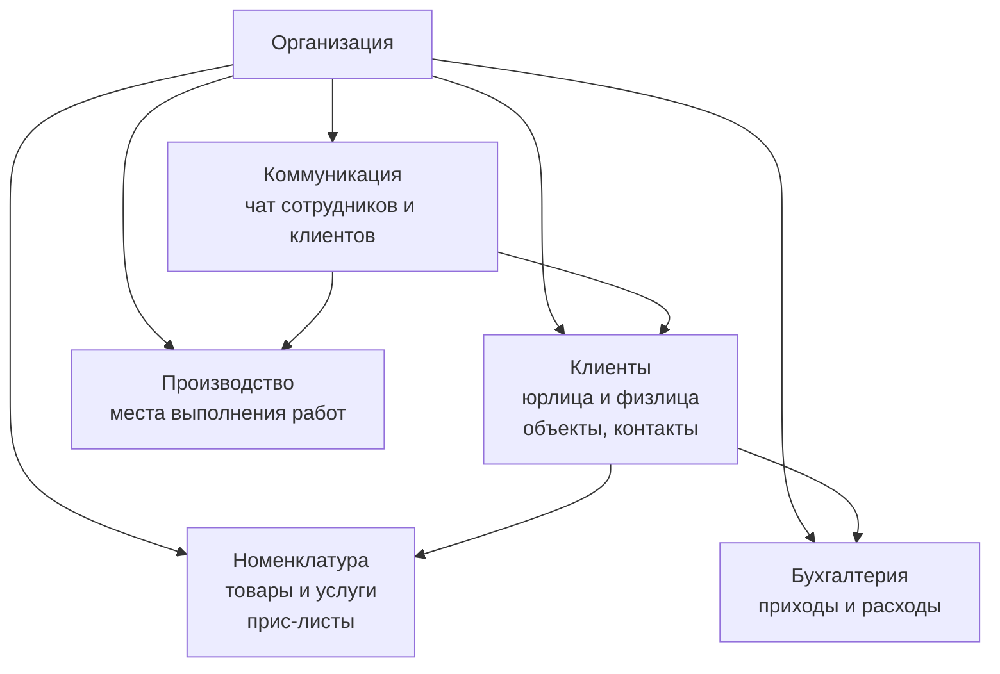

# Архитектура

Техническая архитектура PROFLAUNDRY. Язык этого раздела — точные компоненты, их границы, связи и зависимости.

Бизнес-логика и условия — в разделе [Бизнес-процесс](ref:business).

---

## Уровни системы

```
┌─────────────────────────────────────────────────┐
│                  ПЛАТФОРМА                      │
│   Мета-таблицы, биллинг организаций,            │
│   администрирование тенантов                    │
├─────────────────────────────────────────────────┤
│               ОРГАНИЗАЦИЯ (тенант)              │
│                                                 │
│  ┌──────────┐  ┌──────────────────────────────┐ │
│  │          │  │          МОДУЛИ              │ │
│  │   ЯДРО   │  │  (включаются per-org)        │ │
│  │          │  │  Логистика, Склад, Зарплата, │ │
│  │          │  │  Клиентский портал, ...      │ │
│  └──────────┘  └──────────────────────────────┘ │
└─────────────────────────────────────────────────┘
```

---

## Ядро

Пять универсальных компонентов, применимых к любому бизнесу. Работают без каких-либо модулей.



| Компонент | Назначение | Специфика в ядре |
|-----------|-----------|-----------------|
| **Клиенты** | Юрлица и физлица, объекты, контакты | Базовые атрибуты, прайс-лист, иерархия объектов |
| **Номенклатура** | Справочник товаров/услуг, группы, прайс-листы | Иерархия org → client → object |
| **Производство** | Абстрактная локация выполнения работ | Только базовые атрибуты; смысл задаёт отрасль |
| **Бухгалтерия** | Финансовые потоки (приходы/расходы) | Ручной ввод; автоматизация — через модули |
| **Коммуникация** | Чат с контекстом на любую сущность | Контекст универсальный (GenericForeignKey) |

---

## Платформенный уровень

Работает поверх всех организаций. Не видим самим организациям.

| Компонент | Назначение |
|-----------|-----------|
| **Тенанты** | Управление организациями, их модулями, тарификацией |
| **Мета-реестр клиентов** | Сквозная идентификация (юрлица по ИНН); связывает клиентов из разных организаций |
| **Биллинг платформы** | Учёт подписок организаций |

---

## Модули

Расширяют ядро без его изменения. Активируются per-организация через feature flags.

Управление двухуровневое:
- **Администратор платформы** — включает/выключает любой модуль
- **Организация** — может управлять модулями, которые администратор платформы ей разрешил

### Планируемые модули

| Модуль | Что добавляет |
|--------|--------------|
| **Заказы** | Документ заказа, жизненный цикл, позиции |
| **Логистика** | Маршрутные листы, транспорт, экспедиторы |
| **Клиентский портал** | Внешний доступ клиентов к системе |
| **Склад** | Учёт запасов, закупки, инвентаризация |
| **Зарплата / HR** | Начисление зарплат, кадровый учёт |
| **Аналитика** | Отчёты и дашборды |
| **Уведомления** | Push/email/SMS по событиям системы |

*Конкретный состав и границы модулей уточняются.*

---

## Следующие разделы архитектуры

*Разделы добавляются по мере проектирования.*
