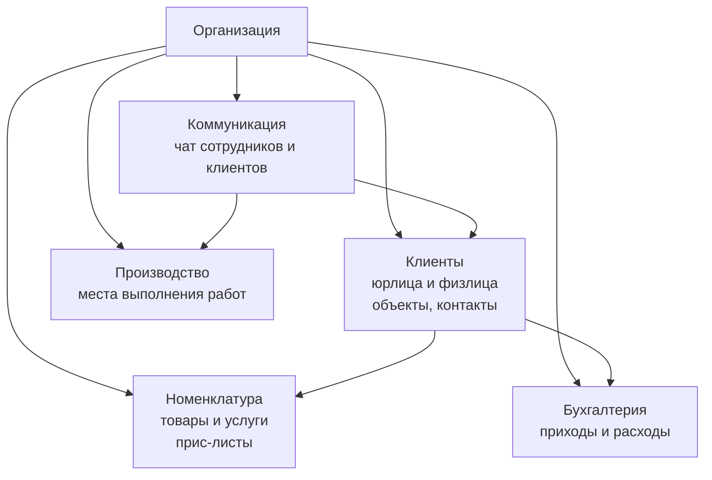

# Архитектура

Техническая архитектура PROFLAUNDRY. Язык этого раздела — точные компоненты, их границы, связи и зависимости.

Бизнес-логика и условия — в разделе [Бизнес-процесс](ref:business).

---

## Типы объектов метаданных (1С-модель)

Структура данных каждой организации строится по модели 1С:Предприятие.

| Тип | Назначение | Наш аналог |
|-----|-----------|-----------|
| **Справочник** | Мастер-данные: клиенты, номенклатура, сотрудники | `CatalogItem` (абстрактный) |
| **Документ** | Бизнес-события с проведением: заказ, оплата | `Document` (абстрактный) |
| **Константы** | Единичные значения уровня организации | `OrgConstant` |
| **Планы счетов** | Иерархический список бухгалтерских счетов | `ChartOfAccountsItem` |
| **Регистр накопления** | Обороты и остатки: взаиморасчёты, заказы | `AccumulationRegisterMovement` (абстр.) |
| **Регистр сведений** | История состояний: история цен, курсы | `InformationRegisterRecord` (абстр.) |
| **Регистр бухгалтерии** | Двойная запись по плану счетов | `AccountingEntry` (абстр.) |
| **Регистр расчёта** | Многошаговые расчёты (зарплата) | *планируется* |
| **Планы видов характеристик** | Наборы доп. реквизитов для объектов | *планируется* |
| **Журнал документов** | Сводный список нескольких типов документов | list view / QuerySet |
| **Отчёт** | Аналитический срез данных, только чтение | query/aggregation |
| **Обработка** | Служебные операции, пакетные изменения | service class / Celery task |
| **Бизнес-процессы и Задачи** | Маршруты согласования и автоматизации | *планируется* |

---

## Проведение документов

Документ проходит через состояния:

```
Черновик → Проведён → (Отменён)
```

- **Черновик** — документ создан, данные не влияют на регистры
- **Проведён** — движения записаны в регистры, документ защищён от изменений
- **Отмена проведения** — движения откатываются, документ возвращается в черновик

**Ключевые правила:**
- Справочник не влияет на проведённые документы. Изменение цены не меняет уже проведённый расчётный лист.
- Документ после проведения защищён. Правка — только через распроведение.
- Регистры — производный слой. Остатки всегда читаются из регистров, не считаются напрямую из документов.

---

## Уровни системы

```
┌─────────────────────────────────────────────────┐
│                  ПЛАТФОРМА                      │
│   Мета-таблицы, биллинг организаций,            │
│   администрирование тенантов                    │
├─────────────────────────────────────────────────┤
│               ОРГАНИЗАЦИЯ (тенант)              │
│                                                 │
│  ┌──────────┐  ┌──────────────────────────────┐ │
│  │          │  │          МОДУЛИ              │ │
│  │   ЯДРО   │  │  (включаются per-org)        │ │
│  │          │  │  Логистика, Склад, Зарплата, │ │
│  │          │  │  Клиентский портал, ...      │ │
│  └──────────┘  └──────────────────────────────┘ │
└─────────────────────────────────────────────────┘
```

---

## Ядро

Пять универсальных компонентов, применимых к любому бизнесу:


```mermaid
flowchart TD
    ORG[Организация]
    ORG --> CLI[Клиенты\nюрлица и физлица\nобъекты, контакты]
    ORG --> NOM[Номенклатура\nтовары и услуги\nприс-листы]
    ORG --> PRD[Производство\nместа выполнения работ]
    ORG --> ACC[Бухгалтерия\nприходы и расходы]
    ORG --> COM[Коммуникация\nчат сотрудников и клиентов]
    CLI --> NOM
    CLI --> ACC
    COM --> CLI
    COM --> PRD
```

| Компонент | Назначение |
|-----------|-----------|
| **Клиенты** | Юрлица и физлица, объекты, контакты, прайс-лист |
| **Номенклатура** | Справочник товаров/услуг, группы, прайс-листы |
| **Производство** | Абстрактная локация выполнения работ |
| **Бухгалтерия** | Финансовые потоки (приходы/расходы), ручной ввод |
| **Коммуникация** | Чат с контекстом на любую сущность (GenericForeignKey) |

---

## Принцип модулей

**Всё в системе — модуль.** Не существует кода «вне модулей». Разница только в режиме включения:

| Тип | Режим |
|-----|-------|
| **Базовый модуль** | Включён по умолчанию для всех организаций |
| **Дополнительный модуль** | Выключен по умолчанию, включается администратором платформы |

Модули могут **расширять** друг друга:

```
Заказы (базовый)
    ├── Приёмка (доп.) — расширяет Заказы под отраслевой процесс
    ├── Логистика (доп.) — добавляет маршруты и транспорт
    └── Клиентский портал (доп.) — даёт клиентам доступ к Заказам
```

### Таблица модулей организации

```
OrganizationModule
├── organization  FK → Organization
├── module        str  (app label, например "orders")
├── is_visible    bool (администратор выдал доступ)
└── is_enabled    bool (модуль активен)
```

| is_visible | is_enabled | Что видит организация |
|:---:|:---:|---|
| false | false | Модуль не существует для организации |
| true | false | Видит модуль, но он отключён |
| true | true | Модуль работает |

---

## Изоляция данных и межуровневые связи

Три уровня изоляции:

```
Платформа  (platform_core)   — данные без привязки к организации
    │
Организация (тенант)         — данные с FK на Organization
    │
Модуль      (modules/*)      — данные модуля, изолированные внутри организации
```

**Общий принцип:** таблица нижнего уровня **никогда не содержит FK** на таблицу верхнего уровня напрямую. Связь между уровнями — через отдельные link-таблицы.

### Паттерн link-таблицы

```
platform_core/
  MetaClient           — платформенный реестр (без org FK)
  MetaClientLink       — связка: MetaClient ↔ Client
modules/clients/
  Client               — организационная таблица (org FK)
                          НЕТ прямой ссылки на MetaClient
```

Схема: `MetaClient ←── MetaClientLink ──→ Client (org A)` и `──→ Client (org B)`

### Правило именования

| Уровень | Шаблон | Пример |
|---------|--------|--------|
| Платформенный реестр | `Meta<Сущность>` | `MetaClient` |
| Таблица-связка | `Meta<Сущность>Link` | `MetaClientLink` |
| Организационная таблица | `<Сущность>` | `Client` |

---

## Техническая реализация модулей

### Модуль = Django App

Каждый модуль — отдельное Django-приложение:

```python
# modules/orders/apps.py
class OrdersConfig(AppConfig):
    name = "modules.orders"
    label = "orders"

    module_meta = {
        "title": "Заказы",
        "is_base": True,
        "depends_on": ["clients", "nomenclature"],
    }
```

### Структура модуля

**Вариант А: плоские файлы** (простые модули):
```
modules/<module>/
  apps.py
  models/
    __init__.py
    directories.py   # Все справочники модуля
    documents.py     # Все документы модуля
    registers.py     # Все регистры модуля
  services/
    posting.py
  admin.py
  migrations/
```

**Вариант Б: папки** (модули с большим числом сущностей):
```
modules/<module>/
  apps.py
  models/
    __init__.py
    directories/
      client.py
      client_object.py
    documents/
      order.py
    registers/
      balance.py
  services/
    posting.py
  admin.py
  migrations/
```

| Путь | Назначение |
|------|-----------|
| `apps.py` | Объявляет модуль: метаданные, зависимости |
| `models/directories` | Справочники — эталонные данные без проведения |
| `models/documents` | Документы — бизнес-события со статусом проведения |
| `models/registers` | Регистры — остатки и история, наполняются через posting |
| `services/posting.py` | Атомарная операция проведения/распроведения |

### Правило изоляции

Модуль **читает** чужие справочники через явный FK (если указал зависимость в `depends_on`).
Модуль **никогда** не пишет напрямую в модели другого модуля — только через хуки и сигналы.

---

## Admin-сайты и URL-пути

| URL | AdminSite | Кто заходит | Фильтрация |
|-----|-----------|-------------|-----------|
| `/platform/` | `platform_admin` | Суперпользователи платформы | Без фильтрации |
| `/app/` | `org_admin` | Сотрудники организаций | По `request.organization` |
| `/portal/` | `client_admin` | Клиенты через портал | По `request.portal_user.client` |

### OrgFilteredMixin

Mixin для `org_admin` — автоматически фильтрует данные по организации:

```python
class OrgFilteredMixin:
    def get_queryset(self, request):
        return super().get_queryset(request).filter(organization=request.organization)

    def save_model(self, request, obj, form, change):
        if not change:
            obj.organization = request.organization
        super().save_model(request, obj, form, change)
```

---

## Настройки модулей

```
platform_core/
  ModuleSettingDefinition   — реестр доступных настроек (платформа)
  OrganizationModuleSetting — переопределения на уровне организации
```

Модуль читает свои настройки через вспомогательную функцию — не напрямую из таблиц:

```python
from platform_core.module_settings import get_setting
timeout = get_setting(request.organization, 'reception', 'processing_timeout_hours')
```

---

## Тестовые данные

```bash
python manage.py create_test_data          # создать
python manage.py create_test_data --reset  # пересоздать
```

Вход после запуска:

```
/platform/  →  admin / admin
/app/       →  test-org / manager / test
/app/       →  test-org / operator / test
```
