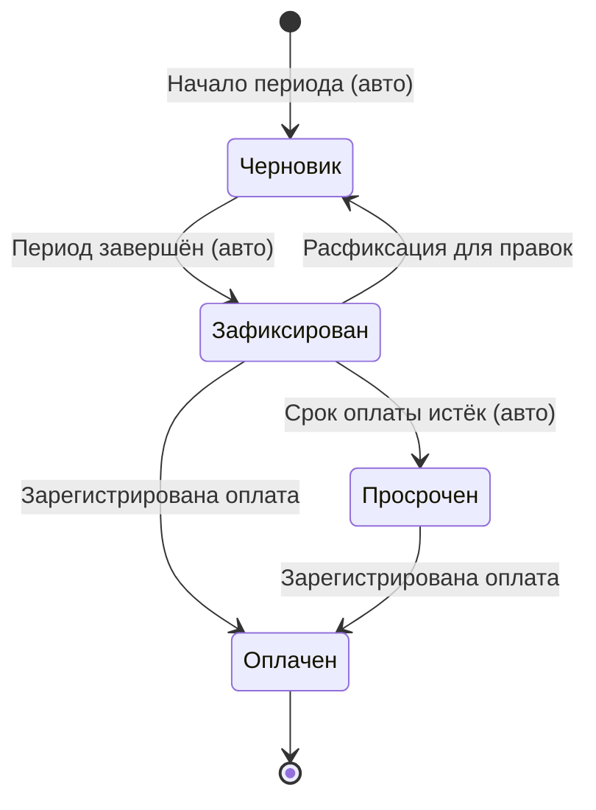

# Расчётный лист

Расчётный лист — финансовый документ, на основании которого выставляется счёт клиенту за расчётный период.

## Принцип работы (по аналогии с 1С)

Расчётный лист **не хранит копию данных**. Он динамически собирается из связанных документов: приёмок и задач логистики. Любое изменение в исходных документах автоматически отражается в расчётном листе — пока он не зафиксирован.

## Что входит в расчётный лист

| Компонент | Источник |
|-----------|----------|
| Стоимость обработки | Расчётные позиции приёмок |
| Стоимость логистики (доставка) | Задачи логистики, связанные с заказами периода |
| Надбавка за срочность | Атрибут заказа |
| Нестандартные позиции | Ручные позиции из приёмок |

## Расчётный период

Определяется в настройках клиента:

| Вариант | Описание |
|---------|----------|
| Неделя | Пн–Вс |
| Полмесяца | 1–15 и 16–конец месяца |
| Месяц | 1–конец месяца |
| Другой | По договорённости |

## Отображение

Таблица с сортировкой по датам. Пользователь может динамически менять сортировку и группировку для получения нужной аналитики (по объектам, по типам изделий, по датам и т.д.).

## Жизненный цикл

### Фиксация и расфиксация

- **Фиксация** происходит автоматически по окончании расчётного периода
- **Расфиксация** доступна менеджеру — для корректировки исходных документов (приёмок, задач логистики). После правок документ фиксируется снова
- **Просрочка** присваивается автоматически если оплата не поступила в срок
