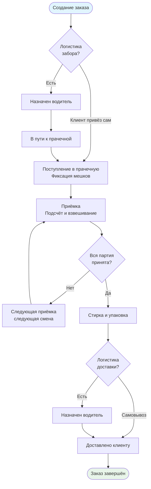

# Бизнес-процесс

Этот раздел описывает бизнес-процессы ProfLaundry.

Подход: каждый процесс разбит на **минимальные атомарные части**, которые могут существовать независимо друг от друга. Это позволяет использовать каждое утверждение как самостоятельную единицу проверки и вносить изменения точечно.

## Архитектурные принципы

Система строится по принципу **1С**: справочники, документы, проведение, регистры. Изменение данных не влияет на уже созданные на их основе документы — в момент проведения данные фиксируются. Система многоарендная (multi-tenant): несколько независимых организаций, каждая со своими данными.

## Участники процесса

| Роль | Что делает |
|------|-----------|
| **Менеджер** | Управляет клиентами, заказами, прайсами, расчётными листами |
| **Прачка** | Принимает бельё, ведёт приёмку, отмечает готовность |
| **Водитель / Экспедитор** | Выполняет задачи логистики (забор, доставка) |
| **Администратор прачечной** | Учёт закупок, расходов прачечной |
| **Бухгалтер** | Работа с расчётными листами и финансами |
| **Клиент** | Создаёт заказы, видит статус (внешний интерфейс) |

Один сотрудник может совмещать несколько ролей. Права настраиваются индивидуально поверх ролевых.

## Карта сущностей

```
Организация
├── Номенклатура (своя для каждой организации)
├── Группы номенклатуры
├── Прайс по умолчанию
│
├── Клиент (юрлицо или физлицо)
│   ├── Прайс клиента (перекрывает организационный)
│   └── Объект (точка забора/доставки)
│       └── Прайс объекта (перекрывает клиентский)
│
├── Прачечная
├── Сотрудник + Роли + Права
│
└── Документы
    ├── Заказ
    ├── Приёмка
    ├── Задача логистики  [модуль, опциональный]
    └── Расчётный лист
```

## Жизненный цикл заказа (общая схема)



## Разделы

- [Утверждения](ref:business.statements) — зафиксированные бизнес-правила
- [Номенклатура и прайс-лист](ref:business.nomenclature) — справочники и ценообразование
- [Заказ](ref:business.order) — жизненный цикл заказа
- [Приёмка](ref:business.reception) — обработка белья в прачечной
- [Логистика](ref:business.logistics) — забор и доставка
- [Расчётный лист](ref:business.billing) — биллинг и расчёты с клиентами
