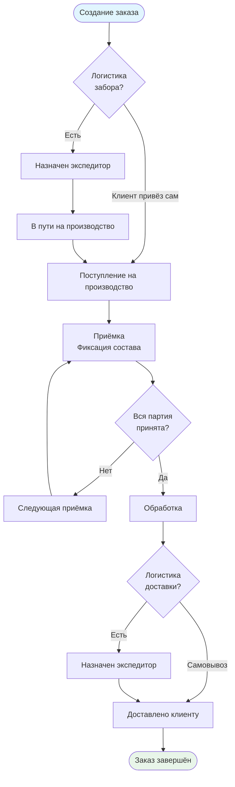

# Бизнес-процесс

Этот раздел описывает бизнес-процессы платформы PROFLAUNDRY.

Платформа универсальна — она подходит для любой сервисной организации, которая принимает изделия от клиентов, обрабатывает их на производстве и возвращает обратно. Конкретная отраслевая специфика (что именно обрабатывается, как именно) выносится в модули организации.

Подход: каждый процесс разбит на **минимальные атомарные части**, которые могут существовать независимо друг от друга.

## Архитектурные принципы

Система строится по принципу **1С**: справочники, документы, проведение, регистры. Изменение данных не влияет на уже созданные на их основе документы — в момент проведения данные фиксируются. Система многоарендная (multi-tenant): несколько независимых организаций, каждая со своими данными.

## Участники процесса

| Роль | Что делает |
|------|-----------|
| **Менеджер** | Управляет клиентами, заказами, прайсами, расчётными листами |
| **Исполнитель** | Принимает изделия, ведёт приёмку, отмечает готовность |
| **Экспедитор** | Выполняет задачи логистики (забор, доставка) |
| **Администратор** | Учёт закупок, расходов организации |
| **Бухгалтер** | Работа с расчётными листами и финансами |
| **Клиент** | Создаёт заказы, видит статус (через клиентский портал) |

Один сотрудник может совмещать несколько ролей. Конкретные названия ролей в каждой организации могут отличаться — это настраивается.

## Карта сущностей

```
Организация
├── Номенклатура (своя для каждой организации)
├── Группы номенклатуры
├── Прайс по умолчанию
│
├── Клиент (юрлицо или физлицо)
│   ├── Прайс клиента (перекрывает организационный)
│   └── Объект (точка забора/доставки)
│       └── Прайс объекта (перекрывает клиентский)
│
├── Производство (место обработки)
├── Сотрудник + Роли + Права
│
└── Документы
    ├── Заказ
    ├── Приёмка              [модуль, опциональный]
    ├── Задача логистики     [модуль, опциональный]
    └── Расчётный лист
```

## Жизненный цикл заказа (общая схема)



## Разделы

- [Утверждения](ref:business.statements) — зафиксированные бизнес-правила
- [Номенклатура и прайс-лист](ref:business.nomenclature) — справочники и ценообразование
- [Заказ](ref:business.order) — жизненный цикл заказа
- [Приёмка](ref:business.reception) — сессия обработки изделий
- [Логистика](ref:business.logistics) — забор и доставка
- [Расчётный лист](ref:business.billing) — биллинг и расчёты с клиентами
