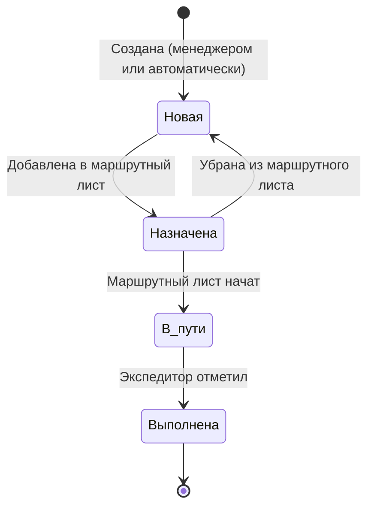

# Логистика

Логистика — опциональный независимый модуль. Система работает без него (клиент может самостоятельно привезти и забрать бельё). Модуль не знает о бизнес-логике оснований — он универсален.

## Роли

| Роль | Доступ к системе | Ответственность |
|------|:---:|----------------|
| **Водитель** | ✗ | Управляет транспортом |
| **Экспедитор** | ✓ | Сопровождает груз, отмечает забор и доставку в системе |

Физически водитель и экспедитор могут быть одним человеком.

## Сущности

### Транспортное средство

| Атрибут | Описание |
|---------|----------|
| Название / номер | Идентификатор |
| Грузоподъёмность | Объём в кг — учитывается при планировании рейса |

### Задача логистики

Минимальная единица — одно перемещение от точки А до точки Б.

| Атрибут | Описание |
|---------|----------|
| Основание | Любой документ: заказ, приёмка, закупка и т.д. |
| Откуда | Адрес отправления |
| Куда | Адрес назначения |
| Статус | Новая → Назначена → В пути → Выполнена |

Отображаемый подстатус формируется из основания и направления:

| Основание | Направление | Подстатус для заказа |
|-----------|------------|---------------------|
| Заказ | клиент → прачечная | «в пути в прачечную» |
| Приёмка | прачечная → клиент | «доставляется клиенту» |
| Закупка | поставщик → прачечная | (не влияет на заказ) |

### Маршрутный лист

Объединяет несколько задач логистики в один рейс.

| Атрибут | Описание |
|---------|----------|
| Транспортное средство | Машина с грузоподъёмностью |
| Водитель | Кто ведёт |
| Экспедитор | Кто сопровождает и работает в системе |
| Задачи | Упорядоченный список остановок |
| Статус | Новый → В рейсе → Завершён |

## Структура рейса

За один рейс экспедитор может объехать несколько адресов и несколько раз заехать в прачечную:

## Жизненный цикл задачи логистики

## Грузоподъёмность

При формировании маршрутного листа учитывается суммарный вес задач относительно грузоподъёмности транспортного средства. Это информационный контроль — не жёсткая блокировка.
