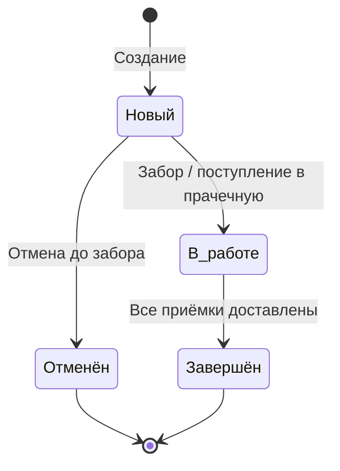
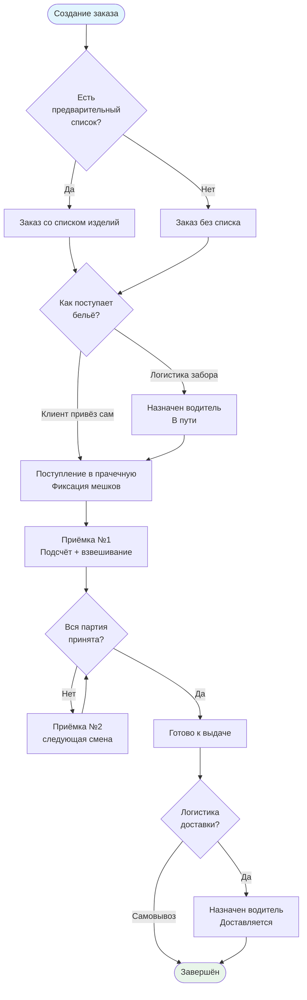

# Заказ

Заказ — центральный документ системы. Представляет собой запрос на обработку партии белья: забор у клиента (или самопривоз), стирка в прачечной, возврат клиенту.

## Атрибуты заказа

| Атрибут | Описание |
|---------|----------|
| Клиент | Кому принадлежит заказ |
| Объект | Адрес забора / доставки |
| Прачечная | Куда направляется бельё |
| Дата создания | Автоматически |
| Дата забора | Когда забрать / когда ожидается поступление |
| Дата доставки | Когда вернуть (необязательно — «по договорённости») |
| Предварительный список | Изделия и примерное количество (необязательно) |
| Надбавка за срочность | Сумма или % надбавки (необязательно) |
| Статус | Новый / В работе / Завершён |
| Подстатус | Текущее внутреннее состояние (в скобках) |

## Кто создаёт заказ

| Кто | Способ | Примечание |
|-----|--------|-----------|
| **Клиент** | Через портал (заявка на забор) | Основной сценарий |
| **Автоматически** | По расписанию объекта | Для постоянных клиентов (BP-015) |
| **Менеджер** | Вручную | По звонку / договорённости |
| **Прачка** | Вручную | Когда клиент сам привёз бельё |

Возможность создания заказа определяется правами пользователя (BP-031).

## Статусы заказа

Внешние статусы — простые, видны клиенту. Подстатус формируется из состояний логистики и приёмок.

### Примеры подстатусов

| Внешний статус | Подстатус (в скобках) |
|---------------|----------------------|
| Новый | — |
| Новый | назначен водитель |
| В работе | в пути в прачечную |
| В работе | в приёмке |
| В работе | постирано, ждёт доставки |
| В работе | частично доставлено |
| Завершён | — |

## Жизненный цикл

## Предварительный список изделий

Заказ может быть создан с предварительным списком (номенклатура + примерное количество) или без него. В обоих случаях при приёмке в прачечной состав доступен для редактирования.

Предварительный список удобен для постоянных клиентов с предсказуемым объёмом — прачке не нужно вводить всё с нуля.

## Прогресс заказа

До создания приёмок прогресс отслеживается по **мешкам**:

| Метрика | Откуда |
|---------|--------|
| Мешков при заборе | Водитель / экспедитор |
| Мешков при поступлении | Прачка |
| Мешков в приёмках | Из созданных приёмок |
| Мешков готово | Из завершённых приёмок |
| Мешков доставлено | Из доставленных приёмок |

Расхождение между мешками при заборе и при поступлении — информационное, не блокирующее.

## Срочность

В заказе можно указать надбавку за срочность — фиксированная сумма или процент. Влияет на итоговую стоимость заказа в расчётном листе.

## Позиции заказа

Позиции (состав белья) хранятся **на уровне заказа**. Каждая позиция может находиться в одном из трёх состояний:

| Состояние | Описание |
|-----------|----------|
| Запланирована | Внесена в предварительный список, приёмка ещё не создана |
| В приёмке | Ссылается на конкретную приёмку, в которой обрабатывается |
| Обработана | Приёмка завершена |

Это позволяет видеть полный состав заказа в любой момент — вне зависимости от состояния приёмок. Позиции без ссылки на приёмку — ещё не переданы в работу.

## Отмена заказа

Заказ можно отменить только **до момента физического забора** белья (пока задача логистики забора не завершена, или если клиент ещё не привёз). После того как бельё поступило — отмена невозможна.
