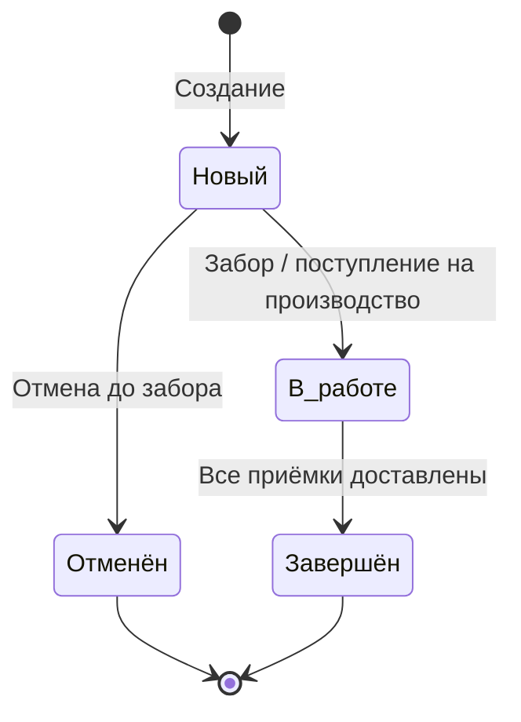
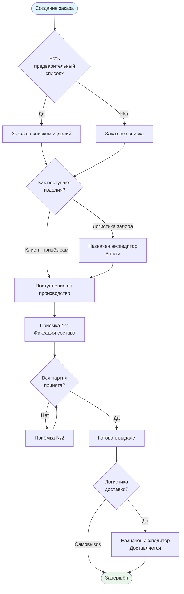

# Заказ

Заказ — центральный документ системы. Представляет собой запрос на обработку партии изделий: забор у клиента (или самопривоз), обработка на производстве, возврат клиенту.

## Атрибуты заказа

| Атрибут | Описание |
|---------|----------|
| Клиент | Кому принадлежит заказ |
| Объект | Адрес забора / доставки |
| Производство | Куда направляются изделия на обработку |
| Дата создания | Автоматически |
| Дата забора | Когда забрать / когда ожидается поступление |
| Дата доставки | Когда вернуть (необязательно — «по договорённости») |
| Предварительный список | Изделия и примерное количество (необязательно) |
| Надбавка за срочность | Сумма или % надбавки (необязательно) |
| Статус | Новый / В работе / Завершён |
| Подстатус | Текущее внутреннее состояние (в скобках) |

## Кто создаёт заказ

| Кто | Способ | Примечание |
|-----|--------|-----------|
| **Клиент** | Через портал (заявка на забор) | Основной сценарий |
| **Автоматически** | По расписанию объекта | Для постоянных клиентов |
| **Менеджер** | Вручную | По звонку / договорённости |
| **Исполнитель** | Вручную | Когда клиент сам привёз изделия |

Возможность создания заказа определяется правами пользователя.

## Статусы заказа

Внешние статусы — простые, видны клиенту. Подстатус формируется из состояний логистики и приёмок.


```mermaid
stateDiagram-v2
    [*] --> Новый : Создание
    Новый --> В_работе : Забор / поступление на производство
    В_работе --> Завершён : Все приёмки доставлены
    Новый --> Отменён : Отмена до забора
    Отменён --> [*]
    Завершён --> [*]
```

### Примеры подстатусов

| Внешний статус | Подстатус (в скобках) |
|---------------|----------------------|
| Новый | — |
| Новый | назначен экспедитор |
| В работе | в пути на производство |
| В работе | в приёмке |
| В работе | обработано, ждёт доставки |
| В работе | частично доставлено |
| Завершён | — |

## Жизненный цикл


```mermaid
flowchart TD
    CREATE([Создание заказа]) --> HAS_LIST{Есть\nпредварительный\nсписок?}
    HAS_LIST -->|Да| WITH_LIST[Заказ со списком изделий]
    HAS_LIST -->|Нет| NO_LIST[Заказ без списка]
    WITH_LIST & NO_LIST --> PICKUP

    PICKUP{Как поступают\nизделия?}
    PICKUP -->|Логистика забора| LOG1[Назначен экспедитор\nВ пути]
    PICKUP -->|Клиент привёз сам| ARRIVE
    LOG1 --> ARRIVE[Поступление на производство]

    ARRIVE --> REC[Приёмка №1\nФиксация состава]
    REC --> MORE{Вся партия\nпринята?}
    MORE -->|Нет| REC2[Приёмка №2]
    REC2 --> MORE
    MORE -->|Да| READY[Готово к выдаче]

    READY --> DELIVER{Логистика\nдоставки?}
    DELIVER -->|Да| LOG2[Назначен экспедитор\nДоставляется]
    DELIVER -->|Самовывоз| DONE
    LOG2 --> DONE([Завершён])

    style CREATE fill:#e1f5fe
    style DONE fill:#e8f5e9
```

## Предварительный список изделий

Заказ может быть создан с предварительным списком (номенклатура + примерное количество) или без него. В обоих случаях при приёмке состав доступен для редактирования.

## Прогресс заказа

До создания приёмок прогресс может отслеживаться по **единицам транспортировки** (мешки, ящики, паллеты — зависит от организации):

| Метрика | Откуда |
|---------|--------|
| Единиц при заборе | Экспедитор |
| Единиц при поступлении | Исполнитель на производстве |
| Единиц в приёмках | Из созданных приёмок |
| Единиц готово | Из завершённых приёмок |
| Единиц доставлено | Из доставленных приёмок |

## Позиции заказа

Подсчётные и расчётные позиции хранятся **на уровне заказа**. Каждая позиция ссылается на приёмку, в рамках которой была внесена.

| Флаг «к обработке» | Ссылка на приёмку | Источник | Смысл |
|:---:|:---:|---|---|
| ✓ | — | Клиент / менеджер | План/запрос, ещё не передан в работу |
| ✗ | есть | Исполнитель / менеджер (факт) | Фактический состав, обработан в этой приёмке |
| ✗ | — | Менеджер (факт) | Фактический состав, без привязки к приёмке |

### Связь подсчётных и расчётных позиций

```
Подсчётные (штуки)        Расчётные (ед.измерения/стоимость)
──────────────────        ──────────────────────────────────
Позиция А     3 шт  ─┐
Позиция Б     3 шт  ─┼──► Группа X   12.5 кг
Позиция В     3 шт  ─┘

Позиция Г     2 шт  ────► Позиция Г   3.2 кг
```

Добавление подсчётной позиции автоматически создаёт или обновляет соответствующую расчётную.

## Отмена заказа

Заказ можно отменить только **до момента физического забора** изделий. После того как изделия поступили на производство — отмена невозможна.
