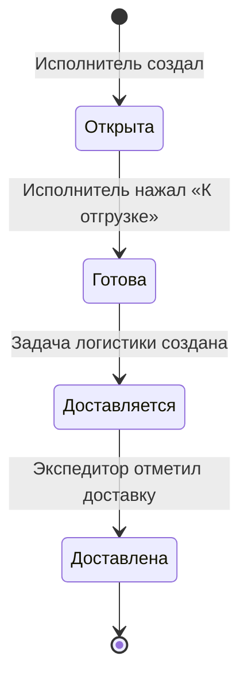

# Приёмка

Приёмка — сессия обработки изделий на производстве. Один заказ может содержать несколько приёмок (если партия большая и не помещается в одну смену).

## Жизненный цикл приёмки



## Приёмка как сессия

Приёмка — это **сессия обработки**, а не контейнер данных. Подсчётные и расчётные позиции хранятся на уровне заказа и лишь ссылаются на приёмку, в которой были добавлены. Исполнитель при работе с приёмкой добавляет позиции в заказ.

Это позволяет видеть полный состав заказа в одном месте, даже если часть позиций обработана в одной приёмке, часть — в другой, а часть ещё не обработана.

## Данные в позициях заказа

Два независимых уровня:

| Уровень | Что хранит | Зачем |
|---------|-----------|-------|
| **Подсчётные позиции** | Номенклатура + количество штук | Верификация, сверка |
| **Расчётные позиции** | Группа или позиция + вес | Основание для расчёта стоимости |

## Интерфейс приёмки

Оба уровня представлены в одной таблице с группировкой:

```
┌─────────────────────────────────┬──────┬──────────┐
│ Наименование                    │  Шт  │    Кг    │
├─────────────────────────────────┼──────┼──────────┤
│ ▾ Группа А                      │      │          │
│     Позиция А1                  │  15  │          │
│     Позиция А2                  │  15  │  [18.5]  │ ← одна ячейка на группу
│     Позиция А3                  │  30  │          │
├─────────────────────────────────┼──────┼──────────┤
│   Позиция Б                     │   3  │  [ 6.2]  │ ← отдельная позиция
├─────────────────────────────────┼──────┼──────────┤
│ ▾ Группа В                      │      │          │
│     Позиция В1                  │  20  │          │
│     Позиция В2                  │  40  │  [auto]  │ ← автовес
└─────────────────────────────────┴──────┴──────────┘
  Единиц транспортировки: 20   Общий вес: 100 кг
```

Левая часть (шт) — подсчётные позиции, заполняются поштучно.
Правая часть (кг) — расчётные позиции, одна на группу или позицию.

## Единицы транспортировки

Единицы транспортировки (мешки, ящики, паллеты — зависит от организации) фиксируются отдельно и являются единицей отслеживания прогресса:

| Момент | Кто фиксирует | Что фиксируется |
|--------|--------------|----------------|
| Забор у клиента | Экспедитор | Количество единиц |
| Поступление на производство | Исполнитель | Количество единиц |
| Завершение приёмки | Исполнитель | Количество выходных единиц |

Расхождение между единицами при заборе и при поступлении — информационное, не блокирующее.

## Автовес

Вспомогательная функция для удобства взвешивания.

**Суть:** вес позиции с автовесом = общий вес единиц транспортировки − сумма весов всех остальных позиций приёмки.

**Пример:**
```
Единиц: 20, общий вес 100 кг
Позиция Б взвешена отдельно: 6 кг
Группа А (автовес): 100 − 6 = 94 кг
```

Не более одной позиции с автовесом в одной приёмке. Реализуется как UI-надстройка над обычным полем веса.

## Что видит исполнитель

| Данные | Видит исполнитель? |
|--------|:---:|
| Наименование позиции / группы | ✓ |
| Единица измерения (шт / кг / м²) | ✓ |
| Количество штук | ✓ |
| Вес | ✓ |
| Цена за единицу | ✗ |
| Итоговая стоимость | ✗ |
| Нестандартные позиции — цена | ✓ (вводит сам) |

## Нестандартные позиции

Изделия, отсутствующие в номенклатуре. Исполнитель вводит название и цену вручную (согласовывает с менеджером). В будущем: выбор из расширенного справочника или заполнение цены менеджером постфактум.

## Правила редактирования

| Кто | Может редактировать |
|-----|-------------------|
| **Исполнитель** | Свою приёмку, пока заказ в его смене |
| **Менеджер** | Любую приёмку без ограничений, включая цены |
