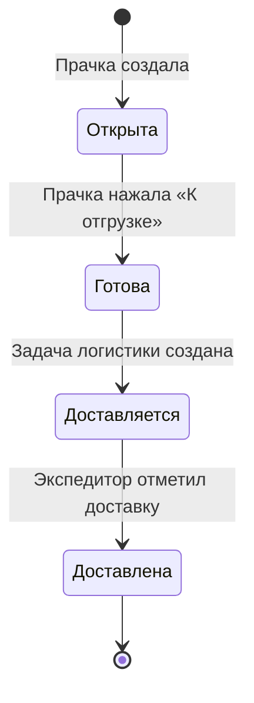

# Приёмка

Приёмка — единица обработки белья в прачечной. Один заказ может содержать несколько приёмок (если партия большая и не помещается в одну смену).

## Жизненный цикл приёмки



## Состав приёмки

Приёмка содержит два независимых уровня данных:

| Уровень | Что хранит | Зачем |
|---------|-----------|-------|
| **Подсчётные позиции** | Номенклатура + количество штук | Верификация, сверка |
| **Расчётные позиции** | Группа или позиция + вес | Основание для расчёта стоимости |

## Интерфейс приёмки

Оба уровня представлены в одной таблице с группировкой:

```
┌─────────────────────────────────┬──────┬──────────┐
│ Наименование                    │  Шт  │    Кг    │
├─────────────────────────────────┼──────┼──────────┤
│ ▾ Постельное бельё              │      │          │
│     Простыни                    │  15  │          │
│     Пододеяльники               │  15  │  [18.5]  │ ← одна ячейка на группу
│     Наволочки                   │  30  │          │
├─────────────────────────────────┼──────┼──────────┤
│   Халаты                        │   3  │  [ 6.2]  │ ← отдельная позиция
├─────────────────────────────────┼──────┼──────────┤
│ ▾ Полотенца                     │      │          │
│     Банные                      │  20  │          │
│     Лицевые                     │  40  │  [auto]  │ ← автовес
└─────────────────────────────────┴──────┴──────────┘
  Мешков: 20 шт   Общий вес: 100 кг
```

Левая часть (шт) — подсчётные позиции, заполняются поштучно.
Правая часть (кг) — расчётные позиции, одна на группу или позицию.

## Мешки

Мешки фиксируются отдельно и являются единицей отслеживания прогресса:

| Момент | Кто фиксирует | Что фиксируется |
|--------|--------------|----------------|
| Забор у клиента | Водитель / экспедитор | Количество мешков |
| Поступление в прачечную | Прачка | Количество мешков |
| Завершение приёмки | Прачка | Количество выходных мешков |

Расхождение между мешками при заборе и при поступлении — информационное, не блокирующее.

## Автовес

Вспомогательная функция для удобства взвешивания.

**Суть:** вес позиции с автовесом = общий вес мешков − сумма весов всех остальных позиций приёмки.

**Пример:**
```
Мешков: 20 шт, общий вес 100 кг
Халаты взвешены отдельно: 6 кг
Постельное бельё (автовес): 100 − 6 = 94 кг
```

Не более одной позиции с автовесом в одной приёмке. Реализуется как UI-надстройка над обычным полем веса.

## Что видит прачка

| Данные | Видит прачка? |
|--------|:---:|
| Наименование позиции / группы | ✓ |
| Единица измерения (шт / кг / м²) | ✓ |
| Количество штук | ✓ |
| Вес | ✓ |
| Цена за единицу | ✗ |
| Итоговая стоимость | ✗ |
| Нестандартные позиции — цена | ✓ (вводит сама) |

## Нестандартные позиции

Изделия, отсутствующие в номенклатуре. Прачка вводит название и цену вручную (согласовывает с менеджером). В будущем: выбор из расширенного справочника или заполнение цены менеджером постфактум.

## Правила редактирования

| Кто | Может редактировать |
|-----|-------------------|
| **Прачка** | Свою приёмку, пока заказ в её смене |
| **Менеджер** | Любую приёмку без ограничений, включая цены |
