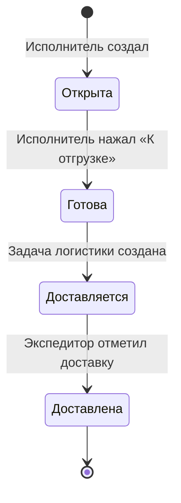

# Приёмка

Приёмка — сессия обработки изделий на производстве. Один заказ может содержать несколько приёмок (если партия большая и не помещается в одну смену).

## Жизненный цикл приёмки


```mermaid
stateDiagram-v2
    [*] --> Открыта : Исполнитель создал
    Открыта --> Готова : Исполнитель нажал «К отгрузке»
    Готова --> Доставляется : Задача логистики создана
    Доставляется --> Доставлена : Экспедитор отметил доставку
    Доставлена --> [*]
```

## Приёмка как сессия

Приёмка — это **сессия обработки**, а не контейнер данных. Подсчётные и расчётные позиции хранятся на уровне заказа и лишь ссылаются на приёмку, в которой были добавлены.

## Данные в позициях заказа

| Уровень | Что хранит | Зачем |
|---------|-----------|-------|
| **Подсчётные позиции** | Номенклатура + количество штук | Верификация, сверка |
| **Расчётные позиции** | Группа или позиция + вес | Основание для расчёта стоимости |

## Интерфейс приёмки

```
┌─────────────────────────────────┬──────┬──────────┐
│ Наименование                    │  Шт  │    Кг    │
├─────────────────────────────────┼──────┼──────────┤
│ ▾ Группа А                      │      │          │
│     Позиция А1                  │  15  │          │
│     Позиция А2                  │  15  │  [18.5]  │ ← одна ячейка на группу
│     Позиция А3                  │  30  │          │
├─────────────────────────────────┼──────┼──────────┤
│   Позиция Б                     │   3  │  [ 6.2]  │ ← отдельная позиция
├─────────────────────────────────┼──────┼──────────┤
│ ▾ Группа В                      │      │          │
│     Позиция В1                  │  20  │          │
│     Позиция В2                  │  40  │  [auto]  │ ← автовес
└─────────────────────────────────┴──────┴──────────┘
  Единиц транспортировки: 20   Общий вес: 100 кг
```

## Единицы транспортировки

| Момент | Кто фиксирует | Что фиксируется |
|--------|--------------|----------------|
| Забор у клиента | Экспедитор | Количество единиц |
| Поступление на производство | Исполнитель | Количество единиц |
| Завершение приёмки | Исполнитель | Количество выходных единиц |

## Автовес

Вес позиции с автовесом = общий вес единиц транспортировки − сумма весов всех остальных позиций приёмки. Не более одной позиции с автовесом в одной приёмке.

## Что видит исполнитель

| Данные | Видит исполнитель? |
|--------|:---:|
| Наименование позиции / группы | ✓ |
| Единица измерения (шт / кг / м²) | ✓ |
| Количество штук | ✓ |
| Вес | ✓ |
| Цена за единицу | ✗ |
| Итоговая стоимость | ✗ |
| Нестандартные позиции — цена | ✓ (вводит сам) |

## Нестандартные позиции

Изделия, отсутствующие в номенклатуре. Исполнитель вводит название и цену вручную.

## Правила редактирования

| Кто | Может редактировать |
|-----|-------------------|
| **Исполнитель** | Свою приёмку, пока заказ в его смене |
| **Менеджер** | Любую приёмку без ограничений, включая цены |
